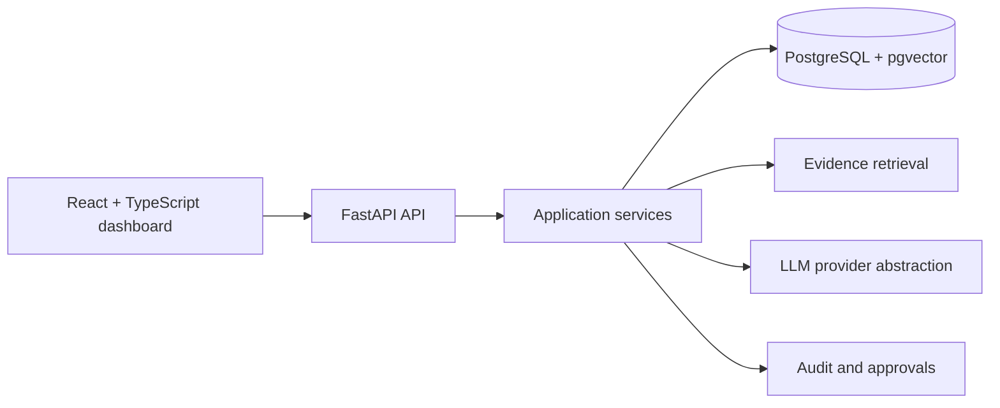

# AI Property Operations Copilot

**An independent AI prototype inspired by
publicly described property-management, service-coordination, document, and customer workflows.** It is not affiliated with, endorsed by, or built with non-public information from PropertySuite.

This portfolio project turns a customer message into an evidence-grounded, approval-gated property operations workflow. It demonstrates deterministic classification, retrieval over synthetic records, explainable provider matching, simulated communications, follow-up escalation, auditability, and evaluation.

## Why this exists

PropertySuite publicly presents a connected platform for Dubai-property owners: property records, documents, payments, service requests and provider coordination in one place. It also publicly cautions that AI output and AI-extracted data can be wrong and that important values should be verified. This prototype explores a safe operational copilot around those public workflows. 

## Demo: recurring AC issue

Send: `My AC is not working again. It was repaired last month.`

The seeded tenant and property are resolved from the request context. The agent classifies HVAC/high priority, retrieves the prior maintenance record, invoice and service report, identifies a recurrence, proposes an inspection, requires human approval, and records each step. It never creates evidence that was not retrieved.

## Architecture



The local test mode uses a deterministic rules provider and synthetic fixture repository. Docker is configured for PostgreSQL/pgvector; production persistence is intentionally a clearly scoped next step.

## Quick start

```bash
cp .env.example .env
docker compose up --build
```

Open `http://localhost:5173`; API docs are at `http://localhost:8000/docs`.

Without Docker, create a Python virtual environment, install `backend/requirements.txt`, then run `uvicorn app.main:app --app-dir backend --reload`. For the frontend, use Node 20+ and run `npm install && npm run dev` in `frontend`.

## Tests

```bash
python -m unittest discover -s backend/tests -v
```

The deterministic and API tests run without an API key or database. The suite includes the recurring-AC request → analysis → approval → audit path and upload validation. See [final review](docs/final-review.md) for results captured in this environment.

## Main safeguards

- Synthetic data only; no PropertySuite data is included.
- Recommendations carry evidence references; unsupported facts are omitted.
- Low confidence, high priority, provider assignment and external communications require approval.
- Mock mode is labelled in the API/UI and is never represented as live model output.
- Provider messages simulate sending; no email, WhatsApp or payment integration is performed.

## Repository layout

```text
backend/     FastAPI, domain services, repository and tests
frontend/    React/TypeScript dashboard
docs/        research, architecture, product, safety and demo material
infra/       PostgreSQL initialization
```

## Limitations

The prototype uses local synthetic fixtures and deterministic retrieval in tests. PDF/DOCX extraction, embeddings, authentication, Alembic migrations and a production queue are represented by integration boundaries, but need infrastructure and security hardening before a production deployment. Docker configuration is included but could not be run in this workspace because Docker is unavailable. Details: 

## Suggested GitHub metadata

- **Repository:** `ai-property-operations-copilot`
- **Description:** Evidence-grounded, approval-gated AI operations copilot for property service workflows (independent portfolio prototype).

## Disclaimer


